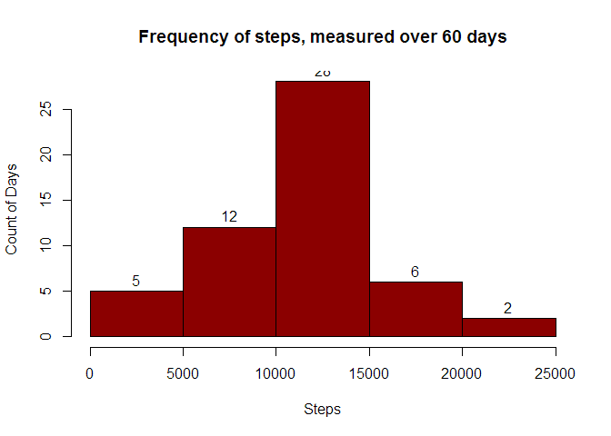
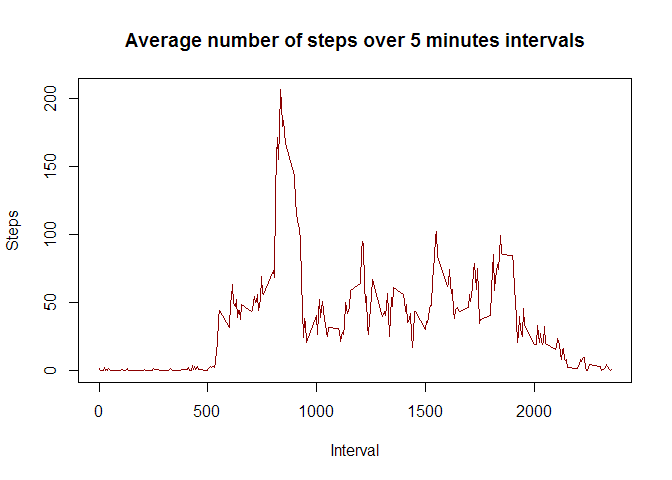
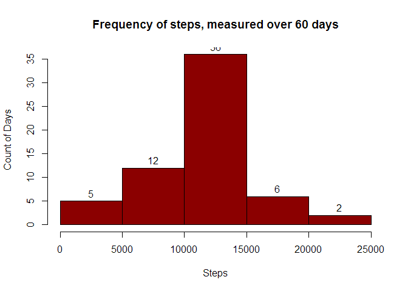
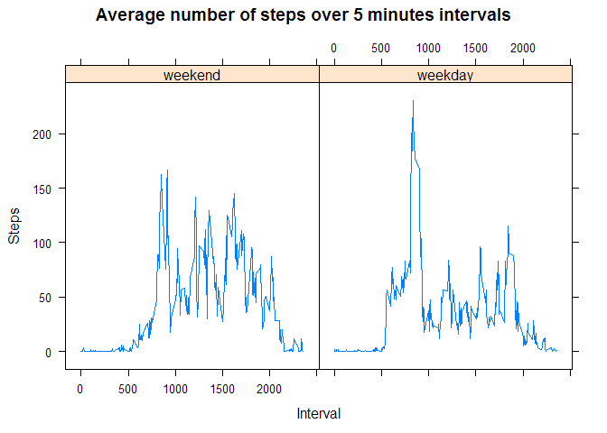

# Reproducible Research: Peer Assessment 1

## Load the dplyr library
Attach the dplyr library, which will be used to transform the data.
Attach the lattice library, which will be used for some plots.


```
## 
## Attaching package: 'dplyr'
## 
## The following object is masked from 'package:stats':
## 
##     filter
## 
## The following objects are masked from 'package:base':
## 
##     intersect, setdiff, setequal, union
```

## Loading and preprocessing the data
1. The data is loaded using read.csv
1. Then, using dplyr, grouped by date
1 And summarised by the total number of steps.
1. Then, using dplyr, grouped by interval
1 And summarised by the average number of steps.

```r
setwd("C:/Users/Nicholas/Dropbox/Coding/GitHub/RepData_PeerAssessment1/")
activity_data <- read.csv("activity.csv")

## summary by date
activity_by_date <- group_by(activity_data, date)
steps_by_date <- summarise(activity_by_date, steps=sum(steps))

## summary by interval
activity_by_interval <- group_by(activity_data, interval)
steps_by_interval <- summarise(activity_by_interval, steps=mean(steps, na.rm=TRUE))
```


## What is mean total number of steps taken per day?
The following graph shows the number of steps, in 5000 step increments. The count is the number of days, measured over 60 days. Days with no data are excluded from the count.

```r
hist(steps_by_date$steps, freq=TRUE, label=TRUE, main="Frequency of steps, measured over 60 days", xlab="Steps", ylab="Count of Days", col="darkred")
```

 

On average, the user takes the following number of steps:

```r
mean(steps_by_date$steps, na.rm = TRUE)
```

```
## [1] 10766.19
```
In total, the user took the following number of steps:

```r
sum(steps_by_date$steps, na.rm = TRUE)
```

```
## [1] 570608
```
The median number of steps taken per day was:

```r
median(steps_by_date$steps, na.rm = TRUE)
```

```
## [1] 10765
```


## What is the average daily activity pattern?
The following graph shows the average number of steps per 5 minutes intervals.

```r
plot(steps_by_interval$interval,steps_by_interval$steps,type="l", main="Average number of steps over 5 minutes intervals", xlab="Interval", ylab="Steps", col="darkred")
```

 

The interval which contains the maximum number of steps is:

```r
which.max(steps_by_interval$steps)
```

```
## [1] 104
```

## Imputing missing values
The data set has the following number of missing variables:

```r
sum(is.na(activity_data$steps))
```

```
## [1] 2304
```

Fill missing values with average for the day

```r
## copy the original data into a new dataset
activity_data_no_na <- activity_data
## loop through all rows
for(i in 1:nrow(activity_data_no_na)){
  ## check if the number of steps is missing
  if(is.na(activity_data_no_na[i,1])) {
    ## replace the number of steps by the average number of steps
    ## by looking up the interval in the steps_by_interval data frame (which has average steps per interval)
    activity_data_no_na[i,1] <- steps_by_interval$steps[steps_by_interval$interval==activity_data_no_na[i,3]]
  }
}
## double check that NA values are replaced
sum(is.na(activity_data_no_na$steps))
```

```
## [1] 0
```

Create a new summary by date

```r
## summary by date
activity_by_date <- group_by(activity_data_no_na, date)
steps_by_date <- summarise(activity_by_date, steps=sum(steps))
```

The following graph shows the number of steps, in 5000 step increments. The count is the number of days, measured over 60 days. Days with no data are excluded from the count.

```r
hist(steps_by_date$steps, freq=TRUE, label=TRUE, main="Frequency of steps, measured over 60 days", xlab="Steps", ylab="Count of Days", col="darkred")
```

 

On average, the user takes the following number of steps:

```r
mean(steps_by_date$steps, na.rm = TRUE)
```

```
## [1] 10766.19
```
In total, the user took the following number of steps:

```r
sum(steps_by_date$steps, na.rm = TRUE)
```

```
## [1] 656737.5
```
The median number of steps taken per day was:

```r
median(steps_by_date$steps, na.rm = TRUE)
```

```
## [1] 10766.19
```


Interestingly, while the average number of steps did not change, the median shifted to the average.


## Are there differences in activity patterns between weekdays and weekends?


```r
## change date to date format
activity_data_no_na$date <- as.Date(activity_data_no_na$date)
# Identify weekdays
week_days <- c('Monday', 'Tuesday', 'Wednesday', 'Thursday', 'Friday')
# Add a week day vs weekend column
activity_data_no_na$wDay <- factor((weekdays(activity_data_no_na$date) %in% week_days),levels=c(FALSE, TRUE), labels=c('weekend', 'weekday'))
# group by week day type
activity_by_wday <- group_by(activity_data_no_na, wDay, interval)
# find the mean, by weekday, by interval
steps_by_wday <- summarise(activity_by_wday, steps=mean(steps))
# plot the weekday vs weekend
xyplot(steps_by_wday$steps~steps_by_wday$interval|steps_by_wday$wDay,type="l",
       main="Average number of steps over 5 minutes intervals",
       xlab="Interval", ylab="Steps")
```

 
